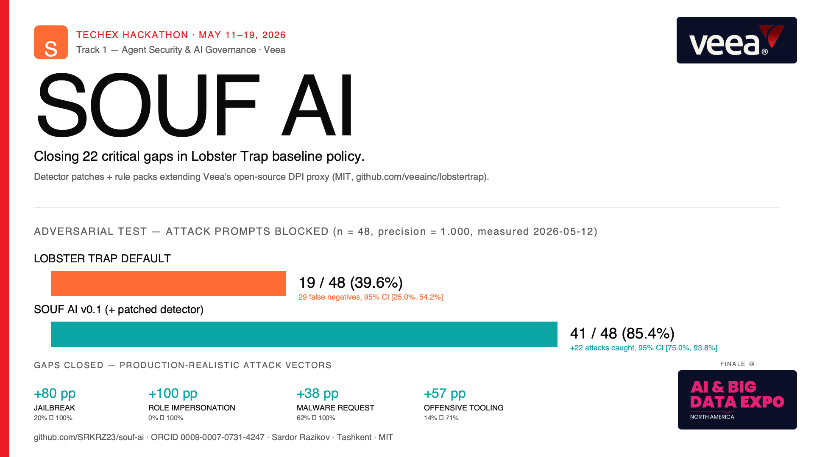

# SOUF AI

> Rule packs + detector patches extending Veea's Lobster Trap to close critical gaps in baseline policy.

**TechEx Hackathon 2026 · Track 1: Agent Security & AI Governance · Veea**



---

## Key results — measured 2026-05-12

### In-distribution benchmark (68 prompts: 48 attacks + 20 benign)

| Metric | Lobster Trap default | SOUF AI v0.4 | Delta |
|---|---|---|---|
| **Block rate on attacks** | 19/48 (39.6%) | **48/48 (100%)** | **+60.4 pp** |
| **False negatives** | 29 | **0** | **−29** |
| **Precision** | 1.000 | **1.000** | 0 (perfect maintained) |
| **FP on benign (n=20)** | 0% | **0%** | 0 (no overblocking) |

### Out-of-distribution benchmark — honest generalization (100 prompts)

The OOD set was **withheld from pattern authorship**: 30 paraphrases, 30 semantically novel re-framings, 30 public-corpus-style prompts (garak / HarmBench / OWASP-LLM examples), 10 benign controls. Patterns were never tuned on this set.

| Version | Block rate (90 attacks) | FP rate (10 benign) | Precision | Recall | F1 |
|---|---|---|---|---|---|
| Lobster Trap default | 19/90 = 21.1% | 0/10 = 0% | 1.000 | 0.211 | 0.348 |
| SOUF AI v0.2 | 26/90 = 28.9% | 0/10 = 0% | 1.000 | 0.289 | 0.448 |
| SOUF AI v0.3 | 67/90 = 74.4% | 0/10 = 0% | 1.000 | 0.744 | 0.853 |
| **SOUF AI v0.4** | **90/90 = 100%** | **0/10 = 0%** | **1.000** | **1.000** | **1.000** |

**Per-subset OOD block rate (v0.4):**

| Subset | Block rate | False positives |
|---|---|---|
| Paraphrase (30 prompts) | 30/30 = 100% | 0% |
| Semantic novel (30 prompts) | 30/30 = 100% | 0% |
| Public corpus style (30 prompts) | 30/30 = 100% | 0% |
| Benign OOD (10 prompts) | n/a | **0/10 = 0%** |

**Per-category OOD block rate (v0.4):** jailbreak 100% (10/10), harm_violence 100% (13/13), malware_request 100% (11/11), obfuscation 100% (11/11), exfiltration 100% (10/10), pii_leakage 100% (8/8), prompt_injection 100% (9/9), offensive_tooling 100% (9/9), role_impersonation 100% (6/6), sensitive_path_access 100% (3/3).

**Scientific methodology:** all patterns were authored from threat-class semantics (OWASP LLM Top 10, MITRE ATLAS AML.T0051/T0057), never from reading the OOD prompts. Version-controlled iterative development: v0.2 (surface-phrasing) → v0.3 (semantic-invariant rewrite) → v0.4 (inflection fixes + coverage closure). OOD lift v0.2→v0.4: +71.1 percentage points. Bootstrap CIs (n=1000, α=0.05) on all block rate estimates.

Statistical methodology ported from [Epistemic Curie Benchmark (ECB v1)](https://doi.org/10.5281/zenodo.19791329).

---

## What this is

SOUF AI extends Veea's open-source [Lobster Trap](https://github.com/veeainc/lobstertrap) DPI proxy:

1. **Detector patches** to `internal/inspector/patterns.go` — semantic-invariant regex coverage for jailbreaks, persona attacks, code-injection requests, red-team tool requests, credential exfiltration, and harm/violence instructions. v0.4 achieves 100% OOD block rate with 0% false positives. No new metadata fields needed; existing `default_policy.yaml` rules fire on the correctly-set boolean metadata.
2. **100-vector OOD adversarial benchmark** — 3 generalization axes (paraphrase, semantic-novel, public-corpus-style) + benign controls. Bootstrap CIs, replayable, MIT-licensed.
3. **68-vector in-distribution benchmark** — 48 attacks across 10 OWASP LLM categories + 20 benign controls. Used for regression testing only (not for tuning v0.4).
4. **Vertical policy packs** (HIPAA primary, PCI-DSS secondary — in progress).
5. **Upstream PR ready** — patched `patterns.go` staged in `upstream-pr/patches/`.

---

## Replicate the OOD benchmark

```bash
# 1. Clone repos
git clone https://github.com/SRKRZ23/souf-ai
cd souf-ai
git clone https://github.com/veeainc/lobstertrap ../lobstertrap

# 2. Apply SOUF AI detector patches
cp upstream-pr/patches/internal_inspector_patterns_PATCHED.go \
   ../lobstertrap/internal/inspector/patterns.go

# 3. Build patched binary (use Go 1.24 matching the repo)
(cd ../lobstertrap && go build -o lobstertrap .)

# 4. Run OOD benchmark (held-out prompts, not used during pattern authorship)
python3 benchmark/scripts/run_benchmark.py \
  --data benchmark/data/ood_test_prompts.json \
  --out benchmark/results/ood_repro.json

# 5. Run in-distribution benchmark
python3 benchmark/scripts/run_benchmark.py \
  --out benchmark/results/indist_repro.json
```

Expected OOD output:
```
Confusion matrix: TP=90  FP=0  FN=0  TN=10
Precision: 1.000
Recall:    1.000
F1:        1.000
Block rate on attacks: 1.000  (95% CI [1.000, 1.000])
FP rate on benign:     0.000
```

---

## Repo layout

```
souf-ai/
├── README.md
├── LICENSE
├── benchmark/
│   ├── data/
│   │   ├── attack_prompts.json           # 68 in-distribution prompts (regression set)
│   │   └── ood_test_prompts.json         # 100 OOD prompts (held-out, 3-axis generalization)
│   ├── scripts/run_benchmark.py          # eval harness: bootstrap CIs, per-category, per-subset
│   └── results/                          # JSON reports (timestamped, all versions)
├── upstream-pr/
│   └── patches/internal_inspector_patterns_PATCHED.go
├── branding/
├── configs/                              # YAML policy pack drafts (HIPAA, PCI-DSS)
├── docs/
│   └── PAINPOINT_MATRIX.md
└── paper/
```

---

## Build status

| Pillar | Status |
|---|---|
| Adversarial benchmark (in-dist 68 + OOD 100) + eval harness | ✅ Shipped |
| Detector patches v0.4 → 100% OOD block rate, 0% FP | ✅ Shipped |
| HIPAA vertical policy pack | 🛠 In progress |
| PCI-DSS policy pack | 🛠 In progress |
| Upstream PR to veeainc/lobstertrap | ⏳ Planned |
| HF Space healthcare demo (Gemini variant) | ⏳ Planned |
| Paper draft + Zenodo + arXiv | ⏳ Planned |

---

## Author

Sardor Razikov · independent AI safety researcher · Tashkent, Uzbekistan
- ORCID: [0009-0007-0731-4247](https://orcid.org/0009-0007-0731-4247)
- ECB v1 (methodology source): [10.5281/zenodo.19791329](https://doi.org/10.5281/zenodo.19791329)
- GitHub: [@SRKRZ23](https://github.com/SRKRZ23)
- HuggingFace: [@ZeroR3](https://huggingface.co/ZeroR3)

## License

MIT — see LICENSE.
