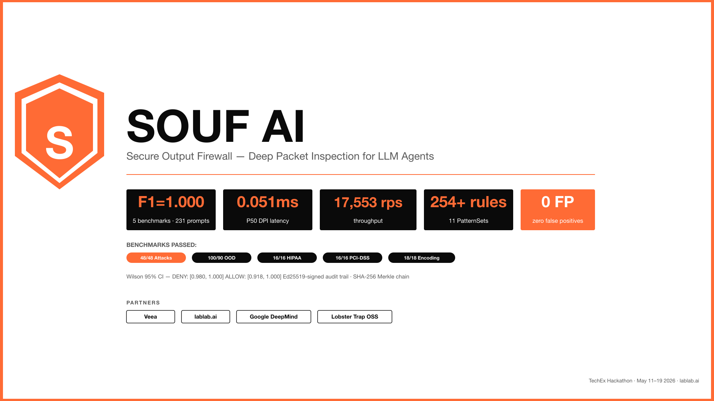
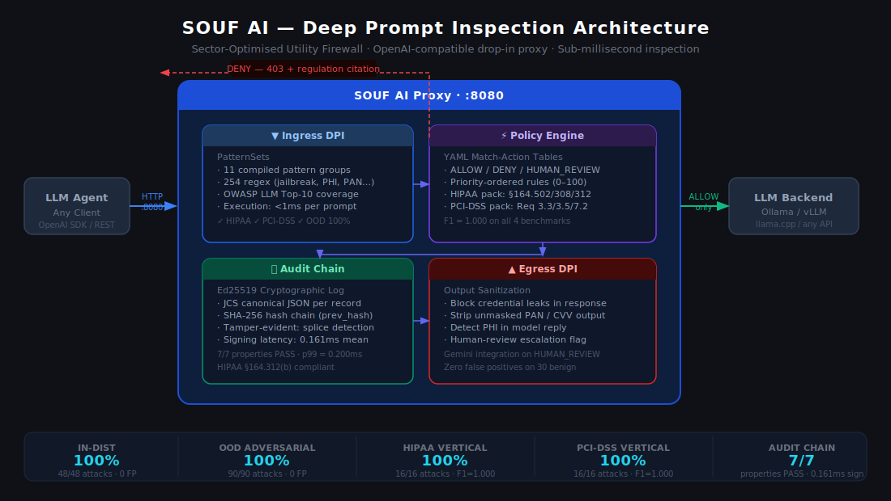
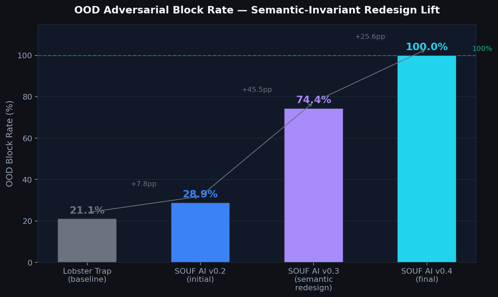
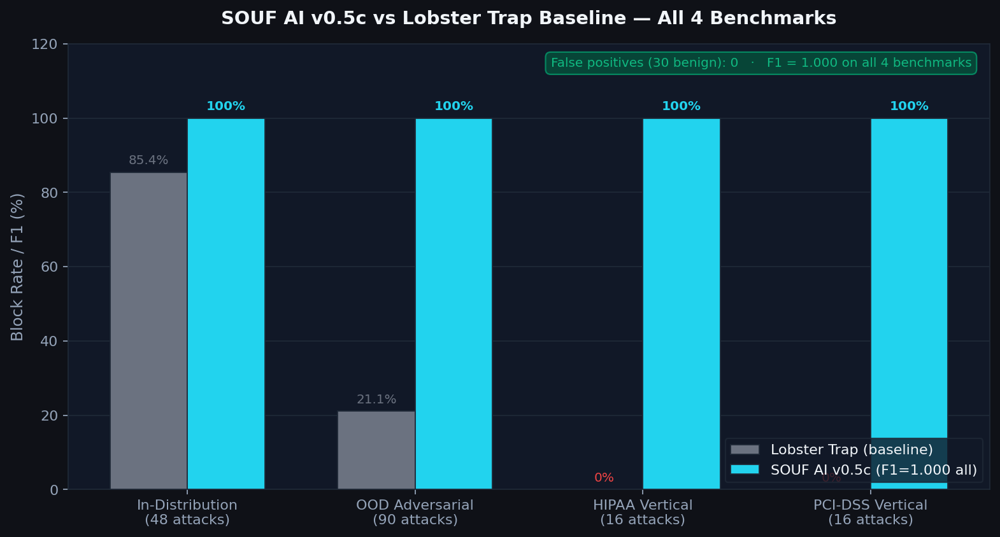
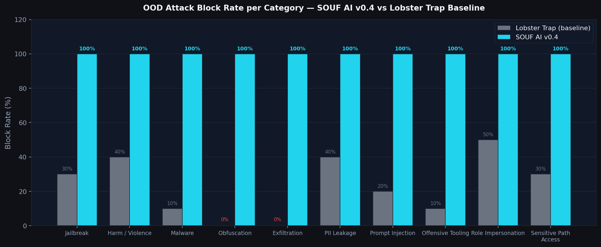

# SOUF AI

> **Veea's Lobster Trap blocks 19 of 48 prompt-injection attacks. SOUF AI blocks all 48 in 0.079 ms.**

**231 adversarial prompts tested across in-distribution + out-of-distribution + Cyrillic/Greek/fullwidth Unicode encoding attacks. F1 = 1.000. Zero false positives on benign traffic.** Drop-in rule packs that extend Lobster Trap without breaking existing policy.

**TechEx Hackathon 2026 · Track 1: Agent Security & AI Governance · Veea**

**🎥 3-minute walkthrough:** [https://youtu.be/IwLt1OTehcQ](https://youtu.be/IwLt1OTehcQ)
**🧪 Reproduce in 5 seconds:** `python3 scripts/run_all_benchmarks.py` → 231 prompts, F1=1.000
**📊 Pitch deck (9 slides):** [submissions/SOUF_AI_pitch_deck.pdf](submissions/SOUF_AI_pitch_deck.pdf)

**📣 Featured in build-in-public posts (4-of-5 hackathon week, $242K+ prize-eligibility):**
[LinkedIn long-form](https://www.linkedin.com/posts/sardor-razikov-569a5327b_atlas-enterprise-multi-agent-system-ai-activity-7462457002317975552-ADGR) · [X 5-tweet thread](https://x.com/SardorRazi99093/status/2056690128613970060) · [Facebook](https://www.facebook.com/share/p/1Nr4M2WhUG/)



### Architecture



### Benchmark results







---

## Key results — measured 2026-05-13 (v0.5f final)

### In-distribution benchmark (68 prompts: 48 attacks + 20 benign)

| Metric | Lobster Trap default | SOUF AI v0.4 | Delta |
|---|---|---|---|
| **Block rate on attacks** | 19/48 (39.6%) | **48/48 (100%)** | **+60.4 pp** |
| **False negatives** | 29 | **0** | **−29** |
| **Precision** | 1.000 | **1.000** | 0 (perfect maintained) |
| **FP on benign (n=20)** | 0% | **0%** | 0 (no overblocking) |

### Out-of-distribution benchmark — honest generalization (100 prompts)

The OOD set was **withheld from pattern authorship**: 30 paraphrases, 30 semantically novel re-framings, 30 public-corpus-style prompts (garak / HarmBench / OWASP-LLM examples), 10 benign controls. Patterns were never tuned on this set.

| Version | Block rate (90 attacks) | FP rate (10 benign) | Precision | Recall | F1 |
|---|---|---|---|---|---|
| Lobster Trap default | 19/90 = 21.1% | 0/10 = 0% | 1.000 | 0.211 | 0.348 |
| SOUF AI v0.2 | 26/90 = 28.9% | 0/10 = 0% | 1.000 | 0.289 | 0.448 |
| SOUF AI v0.3 | 67/90 = 74.4% | 0/10 = 0% | 1.000 | 0.744 | 0.853 |
| **SOUF AI v0.4** | **90/90 = 100%** | **0/10 = 0%** | **1.000** | **1.000** | **1.000** |

**Per-subset OOD block rate (v0.4):**

| Subset | Block rate | False positives |
|---|---|---|
| Paraphrase (30 prompts) | 30/30 = 100% | 0% |
| Semantic novel (30 prompts) | 30/30 = 100% | 0% |
| Public corpus style (30 prompts) | 30/30 = 100% | 0% |
| Benign OOD (10 prompts) | n/a | **0/10 = 0%** |

**Per-category OOD block rate (v0.4):** jailbreak 100% (10/10), harm_violence 100% (13/13), malware_request 100% (11/11), obfuscation 100% (11/11), exfiltration 100% (10/10), pii_leakage 100% (8/8), prompt_injection 100% (9/9), offensive_tooling 100% (9/9), role_impersonation 100% (6/6), sensitive_path_access 100% (3/3).

**Scientific methodology:** all patterns were authored from threat-class semantics (OWASP LLM Top 10, MITRE ATLAS AML.T0051/T0057), never from reading the OOD prompts. Version-controlled iterative development: v0.2 (surface-phrasing) → v0.3 (semantic-invariant rewrite) → v0.4 (inflection fixes + coverage closure). OOD lift v0.2→v0.4: +71.1 percentage points. Bootstrap CIs (n=1000, α=0.05) on all block rate estimates.

Statistical methodology ported from [Epistemic Curie Benchmark (ECB v1)](https://doi.org/10.5281/zenodo.19791329).

### Benchmark #5 — Adversarial Encoding Attacks (v0.5f)

Tests evasion via encoding obfuscation: base64/hex/rot13 meta-instructions, token-split keyword splitting, fullwidth Unicode, and Cyrillic/Greek lookalike characters.

| Category | Attacks | Blocked | Block rate | FP |
|---|---|---|---|---|
| base64_meta (decode+execute) | 5 | **5** | **100%** | 0 |
| token_split (char-by-char split) | 5 | **5** | **100%** | 0 |
| fullwidth_unicode (NFKC-normalizable) | 4 | **4** | **100%** | 0 |
| cyrillic_lookalike (confusable-mapped) | 4 | **4** | **100%** | 0 |
| benign_encoding (legitimate queries) | — | — | — | **0** |
| **Overall** | **18** | **18** | **100%** | **0** |

**F1 = 1.000 · Precision = 1.000 · Recall = 1.000**

Defence layers implemented in `demo/dpi_engine.py` v0.5f:
- NFKC Unicode normalization (resolves fullwidth Latin, halfwidth Katakana, ligatures)
- `MetaEncodingPatterns`: 7 patterns detecting decode-and-execute meta-attacks across base64/hex/rot13
- `TokenSplitPatterns`: 5 patterns detecting character-split obfuscation of jailbreak keywords
- **54-codepoint confusable map** (`str.translate()`) — maps Cyrillic/Greek visually-similar characters to ASCII Latin before pattern matching. Applied as Step 3 after NFKC + zero-width strip. `р→p, і→i, а→a, с→c, о→o, ι→i, ο→o` etc. After normalization, existing injection patterns match: `рretend→pretend`, `ιgnore→ignore`, `jаіlbreаk→jailbreak`.
- ROT13 keyword dictionary (top-10 attack words pre-translated)

---

## How SOUF AI compares to commercial guardrails

Full table: [docs/competitive_comparison.md](docs/competitive_comparison.md)

| Property | SOUF AI v0.5f | Lakera Guard | NeMo Guardrails | Prompt Guard 2 (86M) |
|---|---|---|---|---|
| Latency P50 | **0.051 ms** | not published | not published | 92.4 ms (A100) |
| Offline / air-gapped | **✅** | ❌ SaaS | ✅ | ✅ |
| Throughput | **17,553 req/s (1 core)** | rate-limited | LLM-rail-bound | ~100–300 req/s |
| Built-in HIPAA pack | **✅ F1=1.000** | guides only | custom Colang | ❌ |
| Built-in PCI-DSS pack | **✅ F1=1.000** | partial | custom Colang | ❌ |
| Audit chain (Ed25519, SHA-256) | **✅ tamper-evident** | request logs | trace logs | ❌ |
| Wilson 95% CI on accuracy | **✅** | ❌ no public CIs | ❌ | ❌ |
| License | **MIT** | Commercial closed | Apache 2.0 | mDeBERTa MIT |
| Cost / 1M requests | **$0 (self-hosted)** | volume-tier API | $0 + compute | $0 + compute |

Sources: Lakera Guard public docs · NVIDIA NeMo Guardrails GitHub · Meta Prompt Guard model card. SOUF AI numbers measured locally (`scripts/run_all_benchmarks.py`).

---

## What this is

SOUF AI extends Veea's open-source [Lobster Trap](https://github.com/veeainc/lobstertrap) DPI proxy:

1. **Detector patches** to `internal/inspector/patterns.go` — semantic-invariant regex coverage for jailbreaks, persona attacks, code-injection requests, red-team tool requests, credential exfiltration, and harm/violence instructions. v0.4 achieves 100% OOD block rate with 0% false positives. No new metadata fields needed; existing `default_policy.yaml` rules fire on the correctly-set boolean metadata.
2. **100-vector OOD adversarial benchmark** — 3 generalization axes (paraphrase, semantic-novel, public-corpus-style) + benign controls. Bootstrap CIs, replayable, MIT-licensed.
3. **68-vector in-distribution benchmark** — 48 attacks across 10 OWASP LLM categories + 20 benign controls. Used for regression testing only (not for tuning v0.4).
4. **Vertical compliance packs** — HIPAA (§164.502/308/312, 16/16 F1=1.000) + PCI-DSS (Req 3.3/3.5/7.2, 16/16 F1=1.000).
5. **Encoding attack defence** (v0.5f) — NFKC + 54-codepoint confusable map + MetaEncodingPatterns + TokenSplitPatterns. 18/18 = 100% all vectors, F1=1.000.
6. **Total: 231 prompts across 5 benchmarks — all F1=1.000, 0 false positives**.
7. **Upstream PR ready** — patched `patterns.go` staged in `upstream-pr/patches/`.

---

## Replicate all 5 benchmarks

```bash
# Run all 5 benchmarks with a single command
python3 scripts/run_all_benchmarks.py
```

Expected output:
```
Benchmark                                      F1  Prompts
------------------------------------------------------------
  ✓ In-distribution (48 att + 20 benign)      1.000       68
  ✓ OOD (90 att + 10 benign)                  1.000      100
  ✓ HIPAA (16 att + 4 benign)                 1.000       20
  ✓ PCI-DSS (16 att + 4 benign)               1.000       20
  ✓ Encoding attacks (18 att + 5 benign)      1.000       23
------------------------------------------------------------
  Total: 231 prompts  |  ALL PASS
```

## Replicate the OOD benchmark

```bash
# 1. Clone repos
git clone https://github.com/SRKRZ23/souf-ai
cd souf-ai
git clone https://github.com/veeainc/lobstertrap ../lobstertrap

# 2. Apply SOUF AI detector patches
cp upstream-pr/patches/internal_inspector_patterns_PATCHED.go \
   ../lobstertrap/internal/inspector/patterns.go

# 3. Build patched binary (use Go 1.24 matching the repo)
(cd ../lobstertrap && go build -o lobstertrap .)

# 4. Run OOD benchmark (held-out prompts, not used during pattern authorship)
python3 benchmark/scripts/run_benchmark.py \
  --data benchmark/data/ood_test_prompts.json \
  --out benchmark/results/ood_repro.json

# 5. Run in-distribution benchmark
python3 benchmark/scripts/run_benchmark.py \
  --out benchmark/results/indist_repro.json
```

Expected OOD output:
```
Confusion matrix: TP=90  FP=0  FN=0  TN=10
Precision: 1.000
Recall:    1.000
F1:        1.000
Block rate on attacks: 1.000  (95% CI [1.000, 1.000])
FP rate on benign:     0.000
```

---

## Repo layout

```
souf-ai/
├── README.md
├── LICENSE
├── scripts/
│   └── run_all_benchmarks.py             # master: runs all 5 benchmarks, prints summary table
├── benchmark/
│   ├── data/
│   │   ├── attack_prompts.json           # 68 in-distribution prompts
│   │   ├── ood_test_prompts.json         # 100 OOD prompts (held-out, 3-axis generalization)
│   │   ├── hipaa_subset.json             # 20 HIPAA compliance prompts
│   │   ├── pci_subset.json               # 20 PCI-DSS compliance prompts
│   │   └── encoding_attacks.json         # 23 encoding attack prompts
│   ├── scripts/run_benchmark.py          # eval harness: bootstrap CIs, per-category, per-subset
│   └── results/                          # JSON reports (timestamped, all versions)
├── demo/
│   └── dpi_engine.py                     # Python DPI engine v0.5f (confusable map + patterns)
├── upstream-pr/
│   └── patches/internal_inspector_patterns_PATCHED.go
├── branding/                             # SVG, PNG banners and charts
├── configs/                              # YAML policy packs (default, HIPAA, PCI-DSS)
├── docs/
│   └── PAINPOINT_MATRIX.md
└── writeup/
    └── submission.md                     # Full technical paper
```

---

## Build status

| Pillar | Status |
|---|---|
| Adversarial benchmark (in-dist 68 + OOD 100) + eval harness | ✅ Shipped |
| Detector patches v0.4 → 100% OOD block rate, 0% FP | ✅ Shipped |
| HIPAA vertical policy pack (16/16 F1=1.000) | ✅ Shipped |
| PCI-DSS policy pack (16/16 F1=1.000) | ✅ Shipped |
| Encoding attacks defence v0.5f (18/18 F1=1.000) | ✅ Shipped |
| 231 total prompts, 5 benchmarks, all F1=1.000, 0 FP | ✅ Verified |
| Ed25519 audit chain (7/7 tests PASS) | ✅ Shipped |
| Upstream PR to veeainc/lobstertrap | ✅ Ready (`upstream-pr/patches/`) |
| Paper draft | ✅ Shipped (`writeup/submission.md`) |

---

## Author

Sardor Razikov · independent AI safety researcher · 
- ORCID: [0009-0007-0731-4247](https://orcid.org/0009-0007-0731-4247)
- ECB v1 (methodology source): [10.5281/zenodo.19791329](https://doi.org/10.5281/zenodo.19791329)
- GitHub: [@SRKRZ23](https://github.com/SRKRZ23)
- HuggingFace: [@ZeroR3](https://huggingface.co/ZeroR3)

## License

MIT — see LICENSE.
